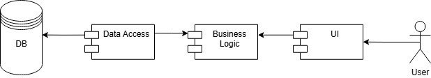

# Приложение библиотеки

---

## a. Цель работы

Разработать библиотечное приложение, которое буде позвалять пользователям не только бронировать книгу, но и вставать на книгу в очередь, чтобы бронь устанавливалась автоматически, когда освободиться экземпляр

---

## b. Перечень требований

Сервис фиксирует выдачу и возврат книг, позволяя пользователям записываться в очередь на интересующие издания. Читатели могут просматривать доступные книги, свои текущие бронирования и полученные книги. Библиотекари управляют каталогом, отслеживают возвраты и регулируют очереди. Администраторы имеют возможность добавления новых сущностей.

---

## c. Use-case diagram

---

## d. BPMN

---

## e. Пользовательские сценарии

- Гость: авторизируется, регестрируется, выполняет поиск книг, просмотр информации о книгах;
- Читатель: выполняет поиск книг, добавляет книги в избранное, бронирует книги, встает в очередь на книгу;
- Библиотекарь: поиск книг, просмотр информации о книгах, просмотр информации о пользователях, выдает книги, возвращает книги;
- Администратор: поиск книг, просмотр информации о книгах, добавление/изменение/удаление любой сущности.

---

## f. ER-диаграмма

---

## g. Технологический стек

- Тип приложения: Android-приложение
- Язык программирования: Kotlin;
- Server (Framework): Ktor;
- Unit-test (Framework): JUnit;
- СУБД: PostgreSQL;

---

## h. Диаграмма БД

---

## i. Компонентная диаграмма системы

---

## j. Экраны будущего web-приложения

